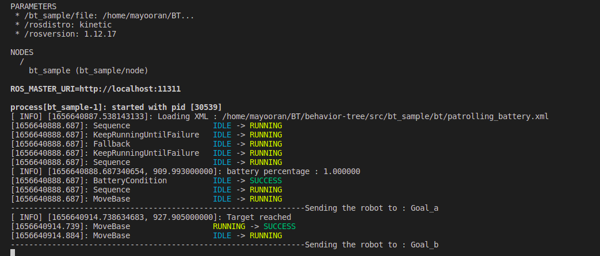
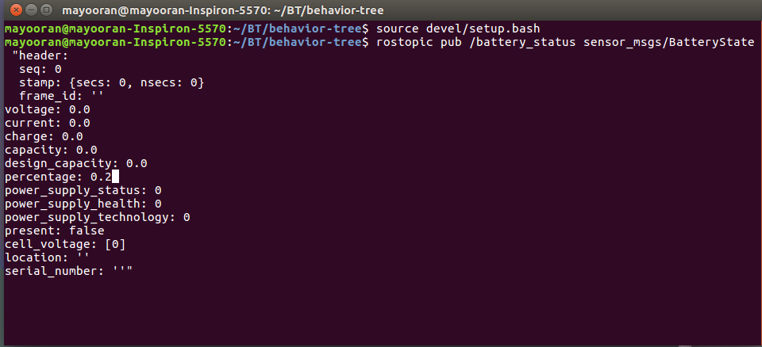

# Patrolling 

## 1. Overview

This is a seperate workspace which will direct you to a seperate repository, where you will be able to implement a patrolling robot. Behavior tree (BT) is used to manage the flow in an intelligent manner. Groot is used to visualize the behavior tree. The terminal also prints the state of the BT by StdCoutLogger.


## 2. Required packages

1. behaviortree-cpp-v3
2. ZeroMQ
3. libsodium
4. Groot
5. RViz
6. Gazebo
7. ROS
8. Ubuntu

### 2.1. Installation of the above packages
The step by step guide to install behaviortree-cpp-v3, ZeroMQ, libsodium and Groot is explained in the following article. 

[The link to the article <---- Click here](https://medium.com/teamarimac/groot-with-ros-a8f7855f8e35)

The installation of ROS Kinetic Kame which is optimum for Ubuntu Xenial (16.04) is found in the ROS official website.

[The link for ROS installation  <---- Click here](http://wiki.ros.org/kinetic/Installation)

Gazebo

[The link for Gazebo installation  <---- Click here](https://classic.gazebosim.org/tutorials?tut=install_ubuntu)

## 3. Behavior Tree

A Behavior Tree (BT) is a way to structure the switching between different tasks in an autonomous agent, such as a robot or a virtual entity in a computer game.

BTs are a very efficient way of creating complex systems that are both modular and reactive. These properties are crucial in many applications, which has led to the spread of BT from computer game programming to many branches of AI and Robotics.

If you are already familiar with Finite State Machines (FSM), you will easily grasp most of the concepts but, hopefully, you will find that BTs are more expressive and easier to reason about.

<strong>The main advantages of Behavior Trees, when compared to FSMs are:</strong>

<ul>
<li>They are intrinsically Hierarchical: this means that we can compose complex behaviors including entire trees as sub-branches of a bigger tree. For instance, the behavior "Fetch Beer" may reuse the tree "Grasp Object".</li>

<li>Their graphical representation has a semantic meaning: it is easier to "read" a BT and understand the corresponding workflow. State transitions in FSMs, by comparisons, are harder to understand both in their textual and graphical representation.</li>

<li>They are more expressive: Ready to use ControlNodes and DecoratorNodes make possible to express more complex control flows. The user can extend the "vocabulary" with his/her own custom nodes.</li>
</ul>

To find more details about behavior trees and follow tutorials, visit the following page.

[bahavior trees tutorials  <---- Click here](https://www.behaviortree.dev/)

<em>behaviortree-cpp-v3</em> is a package which provides with required components to build a BT. 

[download the package here  <---- Click here](https://github.com/BehaviorTree/BehaviorTree.CPP)

## 4. Groot 

Groot is the companion application of the BehaviorTree.CPP library used to create, edit, and visualize behavior trees. Behavior Trees are used as the main method of orchestrating task server logic across a complex navigation and autonomy stack. Behavior Trees, in short BTs, consist of many nodes completing different tasks and control the flow of logic, similar to a Heirarchical or Finite State Machine, but organized in a tree structure. These nodes are of types: Action, Condition, Control, or Decorator are easily buildable by Groot. 

[Introduction about Groot <---- Click here](https://navigation.ros.org/tutorials/docs/using_groot.html)

[Installing Groot <---- Click here](https://github.com/BehaviorTree/Groot)

## 5. How to execute

[The link to the tutorial video ](https://youtu.be/tcCvGF6dZa0)
You can also find the video file in the pictures directory.

### 5.1. Getting started

First, clone the files in the repository [The link to the repository](https://github.com/MayooranT/Behavior-Tree-using-ROS.git) in a new workspace and compile it.

```
git clone https://github.com/MayooranT/Behavior-Tree-using-ROS.git
catkin_make
source devel/setup.bash
```
### 5.2. Run your robot

You can run any robot capable of handling ROS actions. In this example let's run a custom made robot. [Custom made robot](https://github.com/MayooranT/Alpha-robot.git). (To Understand abou this particular robot, go through the README file in the repository)

After successfully implementing the robot, spawn it with RViz, Gazebo and AMCL. For your convenience, a single bash command will do the job!!!

```
./all.sh
```

### 5.3. Clone the BT example

Clone the repository and compile it. [The link to the repository](https://github.com/MayooranT/Behavior-Tree-using-ROS.git)

```
git clone https://github.com/MayooranT/Behavior-Tree-using-ROS.git
catkin_make
source devel/setup.bash
```

### 5.4. Provide patrolling points

You will have to provide 2 patrolling points and a charging dock location <strong>if you are not using the custom robot I mentioned.</strong> To get the location of a point in your world, do the following.

1. Goto Rviz where you visualize your world along with your robot. 

2. In a new terminal (which should be opened in the workspace where your robot lies) type the following command.

```
rostopic echo /clicked_point
```

3. Then in RViz, select the option "Publish point" and place the pointer where you want to get the coordinates.

4. Copy the coordinates from the terminal.


5. Replace the correct patrolling points and the charging dock point in the bt_goals.yaml file under src/bt_sample/param in your BT workspace.


### 5.5.  Run Behavior tree

Launch the behavior tree implemented in a .xml

```
roslaunch bt_sample bt_sample.launch
```

You will see the robot start moving while the terminal you run the above command prints some log info of BT.



This will allow your robot to patrol continuously between the point you gave until the battery of the robot is greater than the lower threshold, which you can change in the yaml file.

### 5.6. Run Groot

1. Run the Groot application.
2. Select Monitor.


3. Select Connect.


Now, you will be able to visualize the BT real time. 
<ul>
<li>The green areas indicate the leafs which returned success. </li>

<li>Orange areas indicate the leaf that is running.</li>

<li>Red areas indicate the leaf that failed.</li>
</ul>

### 5.7. Change battery percentage

This BT is designed in a way that, once the battery percentage becomes less than the lower threshold, the robot will move to the charging dock. When it charges itself in the charging dock, if the battery percentage exceeds the upper threshold, it will return to its patrolling behavior.
We can simulated the battery in two ways.

#### 5.7.1. Change the battery topic instantly

Currently our BT is subscribed to the topic /battery_status to get the battery information as a sensor_msgs/BatteryState message type. We can change it from the terminal instantly. 

1. Open a terminal from the same workspace and source it.
2. Run the following command.

```
rostopic pub /battery_status sensor_msgs/BatteryState
```

3. Press tab
4. Change the percentage. 



#### 5.7.2. Run the battery state publisher from the robot workspace

The battery status of the robot can be simulated artificially by decrementing the initial value with time. Even though, this is not the real battery value, this can be used to simulate and test in a virtual environment. This battery state will publish a ROS defined msg type sensor_msgs/BatteryState to a custom defined topic /battery_status

    rosrun alpha battery_state_pub2.py

Once you change the battery percentage to a value less than the lower threshold, the robot will move to the charging dock. When it charges itself in the charging dock, if the battery percentage exceeds the upper threshold, it will return to its patrolling behavior.

